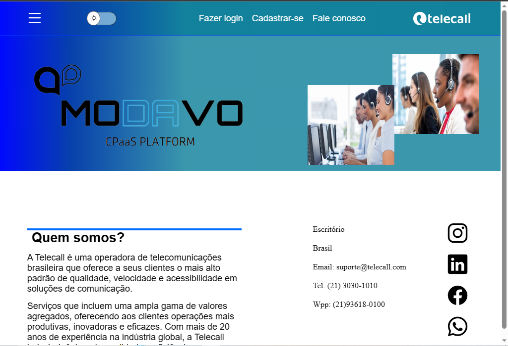

<h1>Projeto cpaas</h1>

--link do projeto hospedado.
https://cpaasoficial.netlify.app/
<a href="https://cpaasoficial.netlify.app/">clique aqui!</a>

<h3>Primeira página. </h3>

<h3>Tela de login e cadastro.</h3>

-Assim que o usuário concluir o login será redirecionado para essa Landing Page.
Que contém os principais serviços.

Ao clicar em cima do serviço será redirecionado para tal página. Que conterá todas as informações.

-Ao clicar em cima de ver informações aparecerá um mini texto explicativo.

 

Páginas que serão abertas ao clicar em cima de qualquer serviço!

