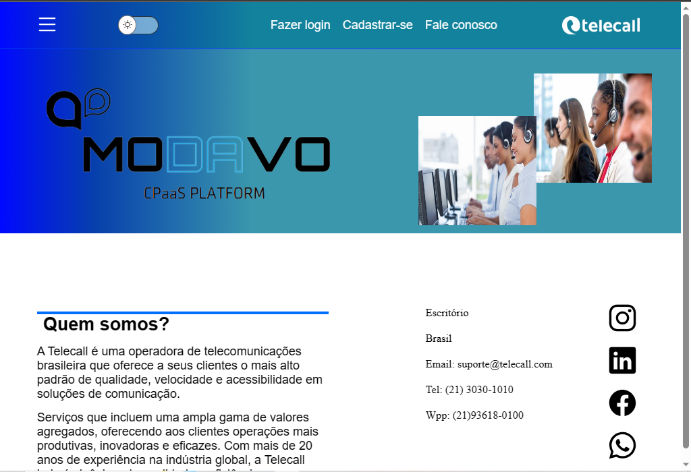

<h1>Projeto cpaas</h1>
link do projeto hospedado
https://648d046c3b645030feec6926--beamish-malabi-c5fe6f.netlify.app/html/cadastro.html

-Print das páginas.

Primeira página.

Tela de login e cadastro

-Assim que o usuário concluir o login será redirecionado para essa Landing Page.
Que contém os principais serviços.

	
-Ao clicar em cima do serviço será redirecionado o serviço que conterá todas as informações.

-Ao clicar em cima de ver informações aparecerá um mini texto explicativo.
 
Páginas que serão abertas ao clicar em cima de qualquer serviço!

